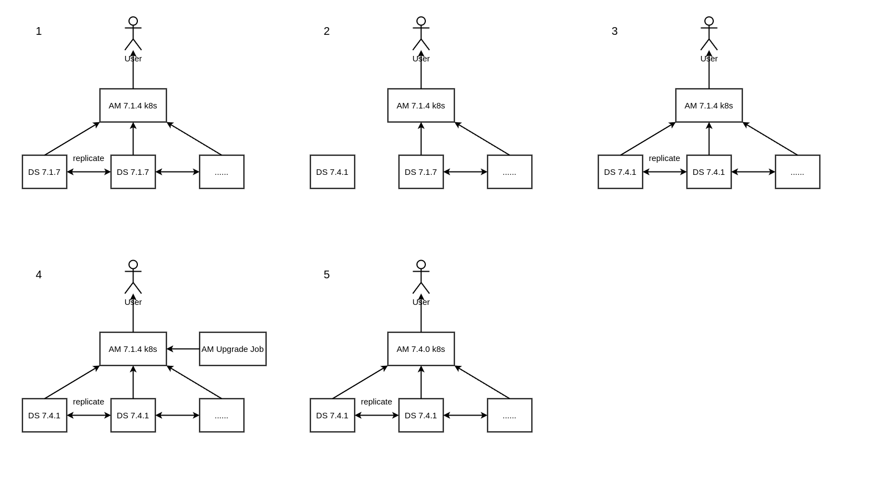

# Upgrade Process for AM Kubernetes Cluster

This guide describes the process of upgrading an AM 7.1.4 Kubernetes cluster with external replicated Directory Servers (DS) to AM 7.4.0 without downtime.

## Upgrade Steps Overview
1. **Upgrade Directory Servers (DS):**
    - Stop DS1, upgrade, and restart.
    - Repeat the process for other DS instances.

2. **Upgrade AM Kubernetes Cluster:**
    - Run the upgrade job on the cluster.
    - Build an image with the new AM WAR file.
    - Config the cluster deployment with new image.
    - Run tests.

## Upgrade Diagram


## 1. Building the Old System

### 1.1 Creating External Directory Servers (DS)

**Configuration:**
- A set of replicated DS is running on multiple AWS EC2 instances as AM configuration, CTS, and identity stores.
- Example setup uses DS version 7.1.7.

**Setup Commands for DS1:**

```bash
# dse1, ds1

export DEPLOYMENT_KEY=ACDDRasfQ4DEOCRM8u4963oSCVMSnA5CBVN1bkVDALAdRZFYWf1w2yw
echo $DEPLOYMENT_KEY

./setup \
--serverId ds1 \
--deploymentKey $DEPLOYMENT_KEY \
--deploymentKeyPassword password \
--rootUserDN uid=admin \
--rootUserPassword password \
--hostname ec2-52-71-219-6.compute-1.amazonaws.com \
--adminConnectorPort 4444 \
--ldapPort 1389 \
--enableStartTls \
--ldapsPort 1636 \
--httpsPort 8443 \
--replicationPort 8989 \
--bootstrapReplicationServer ec2-52-71-219-6.compute-1.amazonaws.com:8989 \
--bootstrapReplicationServer ec2-52-26-251-242.us-west-2.compute.amazonaws.com:8989 \
--profile ds-evaluation \
--set ds-evaluation/generatedUsers:100 \
--profile am-config \
--set am-config/amConfigAdminPassword:password \
--profile am-cts \
--set am-cts/amCtsAdminPassword:password \
--profile am-identity-store \
--set am-identity-store/amIdentityStoreAdminPassword:password \
--profile idm-repo \
--set idm-repo/domain:forgerock.com \
--acceptLicense \
--start

cd cert
keytool -exportcert \
-keystore ../config/keystore \
-storepass $(cat ../config/keystore.pin) \
-alias ssl-key-pair \
-rfc \
-file cert_ds1.pem

cp /usr/lib/jvm/jdk-11-oracle-x64/lib/security/cacerts ./truststore
keytool -storepasswd -keystore ./truststore

keytool \
-importcert \
-file cert_ds1.pem \
-alias ds1 \
-keystore ./truststore

keytool \
-importcert \
-file cert_ds2.pem \
-alias ds2 \
-keystore ./truststore
```
**Setup Commands for DS2:**

```bash
# dsw1, ds2

export DEPLOYMENT_KEY=ACDDRasfQ4DEOCRM8u4963oSCVMSnA5CBVN1bkVDALAdRZFYWf1w2yw
echo $DEPLOYMENT_KEY

./setup \
--serverId ds2 \
--deploymentKey $DEPLOYMENT_KEY \
--deploymentKeyPassword password \
--rootUserDN uid=admin \
--rootUserPassword password \
--hostname ec2-52-26-251-242.us-west-2.compute.amazonaws.com \
--adminConnectorPort 4444 \
--ldapPort 1389 \
--enableStartTls \
--ldapsPort 1636 \
--httpsPort 8443 \
--replicationPort 8989 \
--bootstrapReplicationServer ec2-52-71-219-6.compute-1.amazonaws.com:8989 \
--bootstrapReplicationServer ec2-52-26-251-242.us-west-2.compute.amazonaws.com:8989 \
--profile ds-evaluation \
--set ds-evaluation/generatedUsers:100 \
--profile am-config \
--set am-config/amConfigAdminPassword:password \
--profile am-cts \
--set am-cts/amCtsAdminPassword:password \
--profile am-identity-store \
--set am-identity-store/amIdentityStoreAdminPassword:password \
--profile idm-repo \
--set idm-repo/domain:forgerock.com \
--acceptLicense \
--start

cd cert
keytool -exportcert \
-keystore ../config/keystore \
-storepass $(cat ../config/keystore.pin) \
-alias ssl-key-pair \
-rfc \
-file cert_ds2.pem
```

### 1.2 Installing AM 7.1.4 Kubernetes Cluster

```bash
# Step 1: Copy the DS truststore file to the ./init/cert, ./addon/cert and ./upgrade/cert directories.

# Step 2: Build and push the init image from the ./init directory.
cd ./init
docker build -t k8sam:1.0.13 .
docker tag k8sam:1.0.13 aaronwang0509/k8sam:1.0.13
docker push aaronwang0509/k8sam:1.0.13

# Step 3: Start a Docker container to install the first AM instance.
docker run -p 18080:18080 --name am1 k8sam:1.0.13

# Step 4: Copy the security files out to the addon and upgrade directory.
cd ./addon/init
docker cp am1:/usr/local/tomcat/am/tam/security/keystores .
docker cp am1:/usr/local/tomcat/am/tam/security/secrets/default ./secret
cd ../../upgrade
cp -r ../addon/init .

# Step 5: Build and push the addon image in the ./addon directory.
cd ./addon
docker build -t k8sam:1.1.14 .
docker tag k8sam:1.1.14 aaronwang0509/k8sam:1.1.14
docker push aaronwang0509/k8sam:1.1.14

# Step 6: Go to the ./k8s directory, update the image tag, and deploy the cluster.
cd ./k8s
kubectl apply -f deployment.yaml

# Step 7: Shut down the initial AM instance.
docker rm -f am1
```
The Kubernetes cluster deployment is complete.

## 2. Upgrade DS

### 2.1 Upgrade ds1

```bash
# Stop ds1
./ds717/bin/stop-ds

# Unzip new DS
unzip DS-7.4.1.zip && mv opendj ds741

# Copy new DS files to the old folder
sudo cp -r ds741/* ds717/

# Perform upgrade
./ds717/upgrade

# Restart ds1
./ds717/bin/start-ds
```

### 2.2 Upgrade other DS

```bash
# Repeat the process one by one for other DS instances.
```
DS upgrade complete.

## 3. Upgrade AM Kubernetes Cluster

### 3.1 Build and Run Upgrade Image

```bash
# Build the upgrade image in the ./upgrade directory.
cd ./upgrade
docker build -t k8sam:1.2.9 .
docker tag k8sam:1.2.9 aaronwang0509/k8sam:1.2.9
docker push aaronwang0509/k8sam:1.2.9

# Run the upgrade job and wait for it to complete.
cd ./k8s
kubectl apply -f upgrade.yaml
```

### 3.2 Build and Deploy New AM image to the Cluster

```bash
# Modify the addon Dockerfile to use the new AM-7.4.0.war file, then build and push the new addon image
# COPY AM-7.4.0.war /usr/local/tomcat/webapps/openam.war
cd ./addon
docker build -t k8sam:1.1.15 .
docker tag k8sam:1.1.15 aaronwang0509/k8sam:1.1.15
docker push aaronwang0509/k8sam:1.1.15

# Modify the deployment.yaml file to use the new addon image, then deploy to the cluster
# image: aaronwang0509/k8sam:1.1.15
cd ./k8s
kubectl apply -f deployment.yaml
```

Cluster upgrade complete.

## 4. Backup and Restore

### 4.1 Basic Flow

This upgrade process can be divided into stages:
1. **Stage 0:** DS 7.1.7 and AM 7.1.4
2. **Stage 1:** DS 7.4.1 and AM 7.1.4
3. **Stage 2:** DS 7.4.1 and AM 7.4.0

In each stage, we will take a backup and can roll back to the last stage if needed.

### 4.2 Backup

At the end of section 1.2, before upgrading DS, take a snapshot of all DS replicas.

```bash
# ds1 and ds2
sudo cp -r ds717 ds717_bak0
```

The AM instance is already backed up via the image.

### 4.3 Restore

#### 4.3.1 Rollback from Stage 2 to Stage 1

```bash
# Modify the deployment.yaml file back to the AM 7.1.4 image, then redeploy
# image: aaronwang0509/k8sam:1.1.14
cd ./k8s
kubectl apply -f deployment.yaml
```

#### 4.3.2 Rollback from Stage 1 to Stage 0

```bash
# On each DS replica, stop DS, revert to the previous snapshot, and restart.

./ds717/bin/stop-ds

rm -rf ds717

mv ds717_bak0 ds717

sudo chown -R ec2-user:ec2-user ds717

./ds717/bin/start-ds

# On the main backup replica, run the synchronize command to keep data consistent.

cd ds717/bin

./dsrepl \
initialize \
--baseDN ou=am-config \
--baseDN ou=tokens \
--baseDN ou=identities \
--toAllServers \
--hostname localhost \
--port 4444 \
--bindDN uid=admin \
--bindPassword password \
--trustStorePath ../config/keystore \
--trustStorePassword:file ../config/keystore.pin \
--no-prompt
```

The system is now restored to the previous stage.